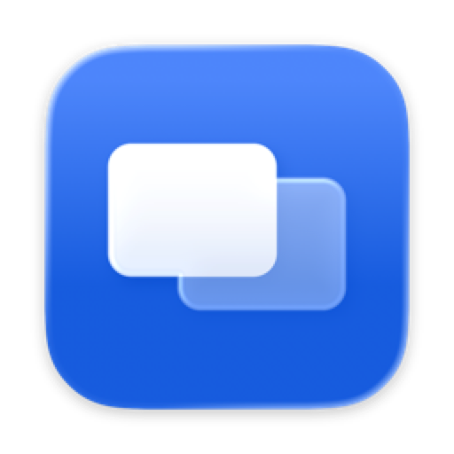

<p align="center">
  
</p>

<h1 align="center">Aloft</h1>

<p align="center">Any window, always on top.</p>

A free macOS menu bar app for keeping a window in front of everything else. Open the picker and every window you have is there as a live preview, so you pick the one you mean at a glance rather than reading a list of titles. Or press one shortcut and whatever you are looking at stays put.

## Features

- **Pick from live previews.** A grid of every open window, captured live, two columns, searchable. Pinned windows sort to the top.
- **One shortcut, from anywhere.** Pins whichever window is frontmost. Set it to whatever you like; Aloft refuses combinations another app already holds, and tells you which app if one answers the same keys behind its back.
- **Menu bar only.** No Dock icon. The pin fills in while something is pinned.
- **Guided first run.** Each permission is asked for once, verified, and the flow moves itself on the moment you grant it.

## Install

### Homebrew

```sh
brew tap iammayron/tap
brew trust iammayron/tap   # Homebrew 6 requires trusting third-party taps once
brew install --cask aloft
```

Aloft is not signed with an Apple Developer ID. The cask removes the Gatekeeper quarantine flag on install, so it opens directly.

### Manual

1. Download `Aloft.dmg` from [Releases](https://github.com/iammayron/aloft/releases), open it, and drag `Aloft.app` to `/Applications`.
2. Remove the quarantine flag, because the disk image is not notarised:

   ```sh
   xattr -dr com.apple.quarantine /Applications/Aloft.app
   ```

   Or right-click `Aloft.app` → Open, then confirm in System Settings → Privacy & Security → Open Anyway.
3. Open Aloft and follow the first-run flow.

## Permissions

Both are required, and Aloft says why before asking for either.

- **Accessibility** lists your open windows and raises the ones you pin. Aloft never types or clicks for you, and the shortcut is registered with the system rather than watched, so it never sees a keystroke that is not its own.
- **Screen Recording** draws the previews in the picker. Frames are captured when a tile scrolls into view, held in memory, and dropped when the panel closes. Nothing is streamed or written to disk.

## How it works, and what it cannot do

macOS does not let one app change another app's window level. `SLSSetWindowLevel` reports success from a foreign connection and is ignored, and `SLSSetUniversalOwner` is entitlement-gated. Doing it properly needs code injected into a process the window server trusts, which needs SIP disabled.

So a pin is a re-raise: Aloft watches the stacking order and lifts a pinned window back whenever something covers it, immediately on an app switch and every 150ms otherwise. In practice it stays in front. What you may notice is a pinned window flashing behind for a frame as you click an overlapping one, because the window server is not enforcing anything — Aloft is putting it back.

## Build from source

Requires Xcode 26 or later. No project file and no package manager: one script compiles, bundles, signs and registers the app.

```sh
./build.sh
open Aloft.app
```

`ALOFT_IDENTITY` overrides the signing identity; it defaults to a local Apple Development certificate. The only runnable check is the stacking logic, which needs no window server:

```sh
swift Tests/occlusion.swift
```

## Licence

MIT
